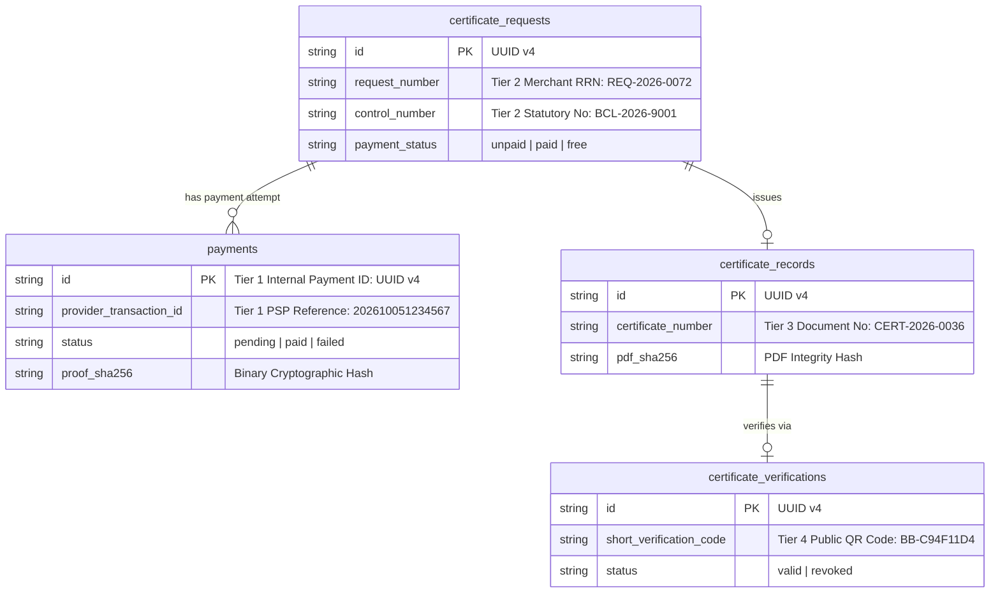

# Barangay Bato e-Certificate System: Manual Payment Workflow, Developer Specifications & Reconciliation Reference

---

## 1. Overview & Regulatory Framework

Under **Republic Act No. 11032** (*Ease of Doing Business and Efficient Government Service Delivery Act of 2018*) and joint circulars from the Department of the Interior and Local Government (**DILG**) and the Anti-Red Tape Authority (**ARTA**), local government units (LGUs) are mandated to provide accessible electronic payment channels for statutory certificates, permits, and clearances.

### Why Manual Off-Platform Payments Over Automated Gateways
In compliance with the **Local Government Code of 1991 (RA 7160)** and **Commission on Audit (COA) Circular No. 2021-014**:
1. **Statutory Fee Preservation:** Certificate fees (e.g. ₱50.00 for Barangay Clearance, Certificate, or Residency) are fixed by Municipal Tax Ordinance. Deducting third-party payment gateway Merchant Discount Rates (MDR)—which typically range from 2.5% to 3.5% + fixed fees per transaction—from municipal collections before remittance to the treasury violates government accounting regulations.
2. **COA Custodianship Invariants:** All collections must be accounted for in full and deposited directly into designated government depository accounts (e.g. LandBank of the Philippines or Development Bank of the Philippines).
3. **No Direct Banking API Required:** The system operates as a human-in-the-loop manual reconciliation workflow. Residents pay off-platform via their personal mobile wallets, and authorized Barangay Treasury staff verifies incoming funds before approving certificate issuance.

---

## 2. Channel Profiles: GCash vs. Maya

| Specification | GCash (G-Xchange, Inc. / Mynt) | Maya (Maya Philippines, Inc.) |
|---|---|---|
| **Official Documentation** | [help.gcash.com](https://help.gcash.com) (GCash for Business) | [developers.maya.ph](https://developers.maya.ph) & [support.maya.ph](https://support.maya.ph) |
| **Merchant Naming Standard** | Institutional Title: `Barangay Bato Treasury` | Institutional Title: `Barangay Bato Treasury Maya` |
| **Reference Number Format** | **13 digits** numeric string (e.g., `1000 2345 6789`) | **12 digits** numeric or alphanumeric (e.g., `MAYA-2026-999888`) |
| **Payer Confirmation Surface** | • Post-transaction digital receipt<br>• In-app Transactions log (90 days / 4-yr PDF)<br>• SMS notification from `2882` | • Post-transaction digital receipt ("View receipt")<br>• In-app Transaction History<br>• SMS notification from `MAYA` |
| **Merchant Notification Surface** | • Instant SMS alert to dedicated Treasury SIM (`2882`)<br>• GCash for Business web portal CSV ledger | • Instant SMS alert to Treasury phone (`MAYA`)<br>• Maya Business Manager settlement reports |
| **Settlement Clearing** | Real-time virtual wallet credit; auto-sweep to bank next banking day | Real-time virtual wallet credit; auto-sweep to bank next banking day |

---

## 3. Official Maya Developer Hub Specifications (`developers.maya.ph`)

### 3.1 Maya API Environments

According to the official [Maya Developer Hub — API Environments](https://developers.maya.ph/reference/api-environments):

| Environment | Component / Resource | Official URL / Domain |
|---|---|---|
| **Sandbox** | **API Gateway Hostname** | `https://pg-sandbox.paymaya.com` |
| | **Hosted Payment Page (Webview)** | `https://payments-web-sandbox.paymaya.com` |
| | **Sandbox Merchant Manager** | `https://manager-sandbox.paymaya.com` |
| **Production** | **API Gateway Hostname** | `https://pg.maya.ph` |
| | **Hosted Payment Page** | `https://payments.maya.ph` or `https://payments.paymaya.com` |
| | **Live Business Manager Dashboard** | `https://pbm.paymaya.com` |

### 3.2 Standardized Mock Test Credentials (Developer Sandbox)
According to [Maya Sandbox Credentials and Cards](https://developers.maya.ph/reference/sandbox-credentials-and-cards):
* **Sandbox Maya E-Wallet Account:**
  * Registered Mobile: `09193890579` | Password: `Password@1` | OTP: `123456`
* **Mock Credit Cards:**
  * Successful Capture: `5123456789012346` | Expiry: `12/25` | CVV: `111`
  * 3DS Passkey Challenge: `5453010000064154` | Expiry: `12/25` | CVV: `111` | Passkey: `secbarry1`
  * Insufficient Balance: `5596459277363286` | Expiry: `12/25` | CVV: `121` | Passkey: `paymaya12`

### 3.3 Official Sandbox Policy on QR Ph
From the official Maya Developer Hub documentation ([How to Try Our Online Payment Endpoints](https://developers.maya.ph/reference/how-to-try-our-online-payment-endpoints)):
> *"Note: Maya e-wallet is typically the primary wallet available for testing inside the sandbox; other alternative payment channels (like QRPh, GCash, or ShopeePay) are generally reserved for validation in the live production space."*

**Architectural Implication:** Because the national QR Ph switch and static merchant standees operate off-platform tied to registered depository accounts, neither Maya nor BSP provides a consumer sandbox mobile app for scanning physical/static QR codes with mock funds. Testing for static QR Ph must be conducted via **Controlled QA Simulation** within the application layer.

### 3.4 Merchant Request Reference Number (`Request-Reference-Number`)
According to [Maya Developer Reference — Remittance & Payment Prerequisites](https://developers.maya.ph/reference/remittance-know-before-you-code) and [Retrieve Payment via RRN](https://developers.maya.ph/reference/getpaymentviarequestreferencenumber-1):
1. **Schema Definition:**
   - Field name: `Request-Reference-Number` (in HTTP headers) or `requestReferenceNumber` (in JSON payloads).
   - Type: **Alphanumeric string**.
   - Length constraint: **Minimum 1 character, Maximum 50 characters**.
2. **Idempotency Guarantee:**
   - Maya uses the merchant RRN as an **idempotency key**. Duplicate API calls with the same RRN prevent accidental double-billing.
3. **Query Endpoint:**
   - Merchants query payment status using their own internal tracking number:
     $$\texttt{GET /v1/payments/rrns/}\{rrn\}$$

---

## 4. End-to-End Operational Lifecycle

```mermaid
sequenceDiagram
    autonumber
    actor Resident as Resident (Citizen)
    participant Portal as e-Cert Web App
    participant Storage as Private Vercel Blob
    actor Staff as Barangay Secretary / Treasurer
    participant Terminal as Treasury Terminal (SMS/Portal)
    actor Admin as Main Admin
    participant Public as Public /verify

    Resident->>Portal: 1. Submits request (Clearance / Residency / Certificate)
    Staff->>Portal: 2. Reviews identity & declared purpose; clicks "Accept Request"
    Note over Portal: Status: "accepted", Payment Status: "unpaid"
    
    Resident->>Portal: 3. Opens /resident/payments/[id], selects GCash or Maya
    Portal-->>Resident: 4. Displays official QR and recipient name ("Barangay Bato Treasury")
    
    Resident->>Resident: 5. Opens mobile wallet, scans QR, pays exact fee (₱50.00)
    Note over Resident: Receives confirmation receipt with Reference ID & Timestamp
    
    Resident->>Portal: 6. Enters Reference ID, Datetime & uploads receipt screenshot
    Portal->>Storage: 7. Validates binary format, hashes SHA-256, stores private Blob
    Note over Portal: Status: "accepted", Payment Status: "pending" (Awaiting Verification)
    
    Staff->>Portal: 8. Opens /admin/payments, views review details
    Staff->>Terminal: 9. Cross-checks Reference ID, Amount (₱50.00) & Datetime in SMS/Portal
    
    alt A. Verified Match
        Staff->>Portal: 10. Clicks "Confirm Payment Received"
        Note over Portal: Payment Status -> "paid" (Certificate issuance unlocked)
        Admin->>Portal: 11. Navigates to /admin/generate-certificate/[id]
        Admin->>Portal: 12. Clicks "Sign & Issue Certificate" with official seal & signature
        Note over Portal: Certificate generated (PDF in Blob) & Short Code generated
        Resident->>Portal: 13. Downloads official signed PDF (~1.46 MB)
        Public->>Portal: 14. Scans QR / enters short code on /verify -> Status: VALID
    else B. Mismatch / Unreadable / Unreflected
        Staff->>Portal: 10. Clicks "Reject Payment Proof" with standardized reason & remarks
        Note over Portal: Payment Status -> "failed" (Request stays "unpaid")
        Resident->>Portal: 11. Views rejection instructions on payment page
        Resident->>Portal: 12. Corrects reference number / re-uploads clear screenshot
        Note over Portal: Returns to "pending" for staff re-evaluation
    end
```

---

## 5. The 4-Way Staff Reconciliation Protocol

When Barangay staff accesses `/admin/payments/[paymentId]`, they must execute a **4-way matching cross-check** against the Barangay Treasury's live merchant device before confirming payment:

| Checkpoint | Validation Standard | Failure / Rejection Reason |
|---|---|---|
| **1. Reference ID Match** | The resident-declared reference number must match the reference in the merchant SMS/portal character-for-character. | `Reference not found` |
| **2. Amount Completeness** | The credited net amount must equal or exceed the statutory certificate fee (`₱50.00`). | `Incorrect amount` |
| **3. Recipient Identity** | The recipient on the receipt must be the official institutional merchant (`Barangay Bato Treasury`), not an individual or personal wallet. | `Wrong recipient` |
| **4. Timestamp & Single-Use** | The transfer timestamp must fall within the current request lifecycle and must not have been previously used. | `Duplicate submission` or `Unreadable receipt` |

---

## 6. Merchant Transaction History & Settlement Ledger Schema

When the Barangay Treasurer reconciles collections at the end of the day or exports statements for COA audit, the merchant portals provide these standardized columns:

### A. GCash for Business CSV Export
- **Reference Number:** 13-digit tracking code matching customer receipt.
- **Date and Time:** Exact timestamp of transfer in PhST.
- **Status:** `Success`, `Failed`, or `Pending`.
- **Gross Amount:** Total fee paid (`₱50.00`).
- **Service Fees:** MDR deducted (if applicable).
- **Net Amount:** Net funds credited to municipal wallet (`₱50.00`).
- **Product Name:** `QR Payment` / `Scan to Pay`.
- **Source / Destination Details:** Sender mobile and Barangay Merchant ID.

### B. Maya Business Manager Export
- **Transaction ID / Reference Number:** 12-digit or alphanumeric ID.
- **Request Reference Number (RRN):** Merchant's internal request number (`REQ-YYYY-NNNN`).
- **Date and Time:** Exact settlement timestamp in PhST.
- **Payment Channel:** `Maya QR` / `QR Ph P2M`.
- **Gross Amount:** Total fee (`₱50.00`).
- **Net Settled Amount:** Net funds credited to Barangay deposit account.
- **Settlement Status:** `SETTLED` / `SUCCESS`.

---

## 7. The 4-Tier Identifier Topology



---

## 8. Handling Failed, Delayed, or Missing Transactions

Official guidelines from the **GCash Help Center** and **Maya Support** establish the following operational rules:

1. **Transient Network Float (15–30 Minute Grace Buffer):**
   - In rare instances of inter-switch network congestion, funds may be debited from the resident's wallet but delayed in reaching the merchant terminal.
   - If a submission occurred within the last 15–30 minutes, staff may hold the item in `pending` and re-check after a brief interval before rejecting.
2. **Automated Platform Reversals:**
   - Under BSP regulations, uncompleted or timed-out transfers are automatically credited back to the customer's wallet within **1 to 2 banking days**.
3. **Formal Rejection Protocol:**
   - If a transaction remains unreflected after the buffer window, staff **must not approve** the payment.
   - Staff selects the appropriate rejection reason (`Reference not found` or `Wrong recipient`) and enters instructions:
     > *"Transaction reference was not found in the Barangay Treasury merchant ledger. Please check your wallet history for automated reversals or verify that you scanned the official Barangay Bato QR."*
   - The resident receives an email notification and can resubmit corrected proof once resolved.

---

## 9. Security Invariants & Anti-Shortcut Enforcements

The application codebase strictly enforces:

1. **Zero Production Shortcuts:**
   - There are **no "Mark Paid", "Fake Payment", "Developer Payment", or automatic-success buttons** anywhere in the system.
   - Every fee-paying request strictly requires human staff verification via `confirmPaymentAction`.
2. **Cryptographic Binary Checksumming:**
   - Uploaded receipt screenshots are hashed immediately upon upload:
     $$\text{proof\_sha256} = \text{SHA256}(\text{file\_bytes})$$
   - Before staff confirms approval, the server re-reads the private Blob file and verifies that the binary checksum matches.
3. **Hard Certificate Issuance Gate:**
   - The `/admin/generate-certificate/[id]` route enforces:
     $$\text{isCertificateIssuanceEligible} \iff \text{request.status} = \text{'accepted'} \land (\text{request.payment\_status} = \text{'paid'} \lor \text{request.fee\_amount} = 0)$$
   - Certificate generation remains physically locked until payment is verified.
4. **Production Demo Mode Suppression:**
   - `lib/env.ts` enforces `paymentDemoMode = process.env.NODE_ENV !== "production" && process.env.PAYMENT_DEMO_MODE === "true"`.
   - In production, demo banners, "thesis presentation only" warnings, and fallback test accounts are completely suppressed.
5. **Private Blob Proxying (Anti-IDOR):**
   - Proof images are proxied through `/api/payments/proof/[id]`.
   - Enforces strict role isolation: staff can view all municipal proofs; residents can only stream proofs tied to their own profile. Unauthorized third-party requests receive `HTTP 403 Forbidden`.

---

## 10. Controlled QA Simulation Standards

To test the system reliably without conducting real monetary transactions or moving live funds:

| Simulation Parameter | Standardized QA Value | Purpose / Assertions |
|---|---|---|
| **GCash Success Reference** | `202610051234567` (13 digits) | Exercises standard GCash happy path $\rightarrow$ Approved $\rightarrow$ Certificate issued. |
| **Maya Success Reference** | `MAYA-2026-999888` (Alphanumeric) | Exercises Maya happy path $\rightarrow$ Approved $\rightarrow$ Certificate issued. |
| **Rejection Test Reference** | `WRONG-REF-000000` | Exercises staff rejection $\rightarrow$ Verifies resident feedback $\rightarrow$ Status: `failed`. |
| **Resubmission Reference** | `2026100588888` | Exercises corrected resubmission $\rightarrow$ Staff approves $\rightarrow$ Status: `paid`. |
| **Synthetic Receipt Image** | Valid PNG image ($\le 5\text{ MB}$) | Exercises magic-byte detection, SHA-256 calculation, and private Blob upload. |
| **Free Certificate Flow** | Indigency (₱0 fee) | Verifies automatic payment bypass and immediate issuance eligibility. |
| **Isolation Tests** | Foreign request ID | Asserts that residents cannot access or pay for other residents' certificate requests. |

---

## 11. Verified Live Production Artifacts

Verified live on `https://barangay-bato-ecertificate-system.vercel.app`:

| Certificate Number | Type | Payment Method & Reference | Verification Status |
|---|---|---|---|
| **`CERT-2026-0036`** | Barangay Clearance | GCash (`202610051234567`) | **`VALID`** ([`/verify?code=BB-C94F11D4`](https://barangay-bato-ecertificate-system.vercel.app/verify?code=BB-C94F11D4)) |
| **`CERT-2026-0037`** | Barangay Certificate | Maya (`MAYA-2026-999888`) | **`VALID`** ([`/verify?code=BB-2962A0C1`](https://barangay-bato-ecertificate-system.vercel.app/verify?code=BB-2962A0C1)) |
| **`CERT-2026-0039`** | Barangay Residency | Resubmitted GCash (`2026100588888`) | **`VALID`** ([`/verify?code=BB-64A57F7C`](https://barangay-bato-ecertificate-system.vercel.app/verify?code=BB-64A57F7C)) |
| **`CERT-2026-0035`** | Barangay Indigency | Free (₱0.00 Statutory Exemption) | **`VALID`** |
